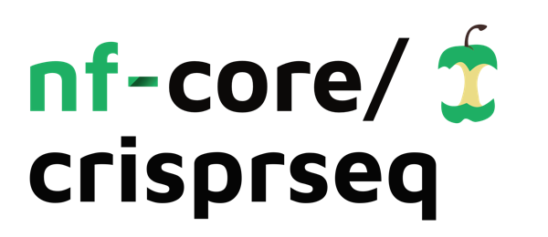

<h1>
  <picture>
    <source media="(prefers-color-scheme: dark)" srcset="docs/images/nf-core-crisprseq_logo_dark.png">
    
  </picture>
</h1>

[](https://github.com/nf-core/crisprseq/actions/workflows/ci.yml)
[](https://github.com/nf-core/crisprseq/actions/workflows/linting.yml)[](https://nf-co.re/crisprseq/results)[](https://doi.org/10.5281/zenodo.7598496)
[](https://www.nf-test.com)

[](https://www.nextflow.io/)
[](https://docs.conda.io/en/latest/)
[](https://www.docker.com/)
[](https://sylabs.io/docs/)
[](https://tower.nf/launch?pipeline=https://github.com/nf-core/crisprseq)

[](https://nfcore.slack.com/channels/crisprseq)[](https://twitter.com/nf_core)[](https://mstdn.science/@nf_core)[](https://www.youtube.com/c/nf-core)

## Introduction

**nf-core/crisprseq** is a bioinformatics best-practice analysis pipeline for the analysis of CRISPR edited data. It allows the evaluation of the quality of gene editing experiments using targeted next generation sequencing (NGS) data (`targeted`) as well as the discovery of important genes from knock-out or activation CRISPR-Cas9 screens using CRISPR pooled DNA (`screening`).

nf-core/crisprseq can be used to analyse:

- CRISPR gene knockouts (KO)
- CRISPR knock-ins (KI)
- Base editing (BE) and prime editing (PE) experiments
- CRISPR screening experiments (KO, CRISPRa (activation) or CRISPRi (interference))

The pipeline is built using [Nextflow](https://www.nextflow.io), a workflow tool to run tasks across multiple compute infrastructures in a very portable manner. It uses Docker/Singularity containers making installation trivial and results highly reproducible. The [Nextflow DSL2](https://www.nextflow.io/docs/latest/dsl2.html) implementation of this pipeline uses one container per process which makes it much easier to maintain and update software dependencies. Where possible, these processes have been submitted to and installed from [nf-core/modules](https://github.com/nf-core/modules) in order to make them available to all nf-core pipelines, and to everyone within the Nextflow community!

On release, automated continuous integration tests run the pipeline on a full-sized dataset on the AWS cloud infrastructure. This ensures that the pipeline runs on AWS, has sensible resource allocation defaults set to run on real-world datasets, and permits the persistent storage of results to benchmark between pipeline releases and other analysis sources. The results obtained from the full-sized test can be viewed on the [nf-core website](https://nf-co.re/crisprseq/results).

## Pipeline summary

<picture>
  <source media="(prefers-color-scheme: dark)" srcset="https://raw.githubusercontent.com/nf-core/crisprseq/dev/docs/images/crisprseq_metropmap_all.png">
  
</picture>

For crispr targeting :

1. Merge paired-end reads ([`Pear`](https://cme.h-its.org/exelixis/web/software/pear/doc.html))
2. Read QC ([`FastQC`](https://www.bioinformatics.babraham.ac.uk/projects/fastqc/))
3. Adapter trimming ([`Cutadapt`](http://dx.doi.org/10.14806/ej.17.1.200))
4. Quality filtering ([`Seqtk`](https://github.com/lh3/seqtk))
5. UMI clustering (optional):
   a. Extract UMI sequences (Python script)
   b. Cluster UMI sequences ([`Vsearch`](https://github.com/torognes/vsearch))
   c. Obtain the most abundant UMI sequence for each cluster ([`Vsearch`](https://github.com/torognes/vsearch))
   d. Obtain a consensus for each cluster ([`minimap2`](https://github.com/lh3/minimap2))
   e. Polish consensus sequence ([`racon`](https://github.com/lbcb-sci/racon))
   f. Repeat a second rand of consensus + polishing (`minimap2` + `racon`)
   g. Obtain the final consensus of each cluster ([Medaka](https://nanoporetech.github.io/medaka/index.html))
6. Read mapping:
   - ([`minimap2`](https://github.com/lh3/minimap2), _default_)
   - ([`bwa`](http://bio-bwa.sourceforge.net/))
   - ([`bowtie2`](http://bowtie-bio.sourceforge.net/bowtie2/index.shtml))
7. CIGAR parsing for edit calling ([`R`](https://www.r-project.org/))

For crispr screening:

1. Read QC ([`FastQC`](https://www.bioinformatics.babraham.ac.uk/projects/fastqc/))
2. Read mapping ([`MAGeCK count`](https://sourceforge.net/p/mageck/wiki/usage/#count))
   - ([`MAGeCK count`](https://github.com/lh3/minimap2), _default_)
   - ([`bowtie2`](http://bowtie-bio.sourceforge.net/bowtie2/index.shtml))
3. Optional: CNV correction and normalization with ([`CRISPRcleanR`](https://github.com/francescojm/CRISPRcleanR))
4. Rank sgRNAs and genes ;
   a. ([MAGeCK test](https://sourceforge.net/p/mageck/wiki/usage/#test))
   b. ([MAGeCK mle](https://sourceforge.net/p/mageck/wiki/Home/#mle))
   c. ([BAGEL2](https://github.com/hart-lab/bagel))
5. Visualize analysis

## Usage

> [!NOTE]
> If you are new to Nextflow and nf-core, please refer to [this page](https://nf-co.re/docs/usage/installation) on how to set-up Nextflow. Make sure to [test your setup](https://nf-co.re/docs/usage/introduction#how-to-run-a-pipeline) with `-profile test` before running the workflow on actual data.

First, prepare a samplesheet with your input data that looks as follows:

`samplesheet.csv`:

```csv
sample,fastq_1,fastq_2,reference,protospacer,template
SAMPLE1,SAMPLE1_R1.fastq.gz,SAMPLE1_R2.fastq.gz,ACTG,ACTG,ACTG
```

or

`samplesheet.csv`:

```csv
sample,fastq_1,fastq_2,condition
SAMPLE1,SAMPLE1_R1.fastq.gz,SAMPLE1_R2.fastq.gz,control
```

For more details on how to build a sample sheet, please refer to the [usage documentation](https://nf-co.re/crisprseq/usage)

Now, you can run the pipeline using:

```bash
nextflow run nf-core/crisprseq --input samplesheet.csv --analysis <targeted/screening> --outdir <OUTDIR> -profile <docker/singularity/podman/shifter/charliecloud/conda/institute>
```

> [!WARNING]
> Please provide pipeline parameters via the CLI or Nextflow `-params-file` option. Custom config files including those provided by the `-c` Nextflow option can be used to provide any configuration _**except for parameters**_;
> see [docs](https://nf-co.re/usage/configuration#custom-configuration-files).

For more details and further functionality, please refer to the [usage documentation](https://nf-co.re/crisprseq/usage) and the [parameter documentation](https://nf-co.re/crisprseq/parameters).

## Pipeline output

To see the results of an example test run with a full size dataset refer to the [results](https://nf-co.re/crisprseq/results) tab on the nf-core website pipeline page.
For more details about the output files and reports, please refer to the
[output documentation](https://nf-co.re/crisprseq/output).

## Credits

nf-core/crisprseq targeted is based on [CRISPR-A](https://doi.org/10.1101/2022.09.02.506351) [[Sanvicente-García, et.al. (2023)](https://doi.org/10.1371/journal.pcbi.1011137)], originally written by Marta Sanvicente García at [Translational Synthetic Biology](https://synbio.upf.edu/) from [Universitat Pompeu Fabra](https://www.upf.edu/home).
It was re-written in Nextflow DSL2 and is primarily maintained by Júlia Mir Pedrol ([@mirpedrol](https://github.com/mirpedrol)) at [Quantitative Biology Center (QBiC)](https://www.qbic.uni-tuebingen.de/) from [Universität Tübingen](https://uni-tuebingen.de/en/).

nf-core/crisprseq screening was written and is primarly maintained by Laurence Kuhlburger ([@LaurenceKuhl](https://github.com/LaurenceKuhl)) at [Quantitative Biology Center (QBiC)](https://www.qbic.uni-tuebingen.de/) from [Universität Tübingen](https://uni-tuebingen.de/en/).

Main developers:

- [@LaurenceKuhl](https://github.com/LaurenceKuhl)
- [@mirpedrol](https://github.com/mirpedrol)

We thank the following people for their extensive assistance in the development of this pipeline:

- [@ggabernet](https://github.com/ggabernet)
- [@jianhong](https://github.com/jianhong)
- [@mashehu](https://github.com/mashehu)
- [@msanvicente](https://github.com/msanvicente)
- [@SusiJo](https://github.com/SusiJo)

## Contributions and Support

If you would like to contribute to this pipeline, please see the [contributing guidelines](.github/CONTRIBUTING.md).

For further information or help, don't hesitate to get in touch on the [Slack `#crisprseq` channel](https://nfcore.slack.com/channels/crisprseq) (you can join with [this invite](https://nf-co.re/join/slack)).

## Citations

If you use nf-core/crisprseq for your analysis, please cite it using the following doi: [10.5281/zenodo.7598496](https://doi.org/10.5281/zenodo.7598496)

An extensive list of references for the tools used by the pipeline can be found in the [`CITATIONS.md`](CITATIONS.md) file.

You can cite the `nf-core` publication as follows:

> **The nf-core framework for community-curated bioinformatics pipelines.**
>
> Philip Ewels, Alexander Peltzer, Sven Fillinger, Harshil Patel, Johannes Alneberg, Andreas Wilm, Maxime Ulysse Garcia, Paolo Di Tommaso & Sven Nahnsen.
>
> _Nat Biotechnol._ 2020 Feb 13. doi: [10.1038/s41587-020-0439-x](https://dx.doi.org/10.1038/s41587-020-0439-x).

Crispr-Analytics:

> Sanvicente-García M, García-Valiente A, Jouide S, Jaraba-Wallace J, Bautista E, Escobosa M, et al. (2023)
> CRISPR-Analytics (CRISPR-A): A platform for precise analytics and simulations for gene editing. PLoS Comput Biol 19(5): e1011137. https://doi.org/10.1371/journal.pcbi.1011137
