# nf-core/crisprseq: Output

## Introduction

This document describes the output produced by the analysis of targeted editing. Most of the plots are taken from the MultiQC report, which summarises results at the end of the pipeline.

The directories listed below will be created in the results directory after the pipeline has finished. All paths are relative to the top-level results directory.

## Pipeline overview

The pipeline is built using [Nextflow](https://www.nextflow.io/) and processes data using the following steps:

- [Preprocessing](#preprocessing)
  - [sequences](#sequences) - Input sequence preparation (reference, protospacer, template)
  - [cat](#cat) - Concatenate sample fastq files if required
  - [pear](#pear) - Join double-end reads if required
  - [fastqc](#fastqc) - Read Quality Control
  - [adapters](#adapters) - Find adapters (Overrepresented sequences) in reads
  - [cutadapt](#cutadapt) - Trim adapters
  - [seqtk](#seqtk) - Mask low-quality bases
- [UMI clustering](#umi-clustering)
  - [vsearch](#vsearch)
  - [minimap2 umi](#minimap2-umi)
  - [racon](#racon)
  - [medaka](#medaka)
- [Mapping](#mapping)
  - [minimap2](#minimap2) - Mapping reads to reference
  - [BWA](#bwa) - Mapping reads to reference
  - [bowtie2](#bowtie2) - Mapping reads to reference
- [Edits calling](#edits-calling)
  - [CIGAR](#cigar) - Parse CIGAR to call edits
  - [Output plots](#output-plots) - Results visualisation
- [MultiQC](#multiqc) - Aggregate report describing results and QC from the whole pipeline
- [Pipeline information](#pipeline-information) - Report metrics generated during the workflow execution

## Preprocessing

### Sequences

Output files

- `preprocessing/sequences/`
  - `*_reference.fasta`: Sequence used as a reference.
  - `*_template.fasta`: Provided template sequence.
  - `*_correctOrient.fasta`: Reference sequence in the correct orientation.
  - `_NewReference.fasta`: New reference generated from adding the changes made by the template to the original reference.
  - `*_template-align.bam`: Alignment of the new reference (with template changes) to the original reference.

Contains the input sequences (reference, protospacer and template). Sequences are preprocessed as required:

- The reference is returned in the correct orientation.

  :::info
  In order to provide the reference in the correct orientation, the protospacer is searched in the reference sequence. The reverse complement is returned if the protospacer matches the reference in reverse complement.
  :::

- The template is used to obtain a new reference with the expected changed.

### cat

Output files

- `preprocessing/cat/`
  - `*.merged.fastq.gz`: Concatenated fastq files

If multiple libraries/runs have been provided for the same sample in the input samplesheet (e.g. to increase sequencing depth) then these will be merged at the very beginning of the pipeline in order to have consistent sample naming throughout the pipeline. Please refer to the [usage](https://nf-co.re/crisprseq/usage) documentation to see how to specify these samples in the input samplesheet.

### Pear

Output files

- `preprocessing/pear/`
  - `*.assembled.fastq.gz`: Assembled paired-end reads
  - `*.discarded.fastq.gz`: Discarded reads
  - `*.unassembled.forward.fastq.gz`: Unassembled paired-end reads - forward (R1)
  - `*.unassembled.reverse.fastq.gz`: Unassembled paired-end reads - reverse (R2)

[PEAR](https://cme.h-its.org/exelixis/web/software/pear/) is a pair-end read merger.

### FastQC

Output files

- `fastqc/`
  - `*_fastqc.html`: FastQC report containing quality metrics.
  - `*_fastqc.zip`: Zip archive containing the FastQC report, tab-delimited data file and plot images.

[FastQC](http://www.bioinformatics.babraham.ac.uk/projects/fastqc/) gives general quality metrics about your sequenced reads. It provides information about the quality score distribution across your reads, per base sequence content (%A/T/G/C), adapter contamination and overrepresented sequences. For further reading and documentation see the [FastQC help pages](http://www.bioinformatics.babraham.ac.uk/projects/fastqc/Help/).

:::info
The FastQC plots displayed in the MultiQC report shows _untrimmed_ reads. They may contain adapter sequences and potentially regions with low quality.
:::

### Adapters

Output files

- `preprocessing/adapters/`
  - `*_overrepresented.fasta`: Contains overrepresented sequences found by FastQC

[FastQC](http://www.bioinformatics.babraham.ac.uk/projects/fastqc/) finds over-represented sequences in samples. It lists all of the sequence which make up more than 0.1% of the total reads. For each over-represented sequence the program will look for matches in a database of common contaminants and will report the best hit it finds. Hits must be at least 20bp in length and have no more than 1 mismatch.

### Cutadapt

Output files

- `preprocessing/cutadapt/`
  - `*.cutadapt.log`: Cutadapt log file
  - `*.trim.fastq.gz`: Sample reads trimmed with overrepresented sequences removed

### Seqtk

Output files

- `preprocessing/seqtk/`
  - `*.seqtk-seq.fastq.gz`: Quality filtered reads.

[Seqtk](https://github.com/lh3/seqtk) masks (converts to Ns) bases with quality lower than 20 and removes sequences shorter than 80 bases.

## UMI clustering

### vsearch

Output files

- `vsearch/`
  - `*_clusters*`: Contains all UMI sequences which clustered together.
  - `*_clusters*_top.fasta`: Contains the most abundant UMI sequence from the cluster.

[VSEARCH](https://github.com/torognes/vsearch) is a versatile open-source tool which includes chimera detection, clustering, dereplication and rereplication, extraction, FASTA/FASTQ/SFF file processing, masking, orienting, pair-wise alignment, restriction site cutting, searching, shuffling, sorting, subsampling, and taxonomic classification of amplicon sequences for metagenomics, genomics, and population genetics. `vsearch/clsuter` can cluster sequences using a single-pass, greedy centroid-based clustering algorithm. `vsearch/sort` can sort fasta entries by decreasing abundance (`--sortbysize`) or sequence length (`--sortbylength`).

### minimap2_umi

Output files

- `minimap2_umi/`
  - `*_sequences_clycle[1,2].paf`: Alignment of the cluster sequences against the top UMi sequence in paf format.

[Minimap2](https://github.com/lh3/minimap2) is a sequence alignment program that aligns DNA sequences against a reference database.

### racon

Output files

- `racon/`
  - `*_sequences_clycle[1,2]_assembly_consensus.fasta.gz`: Consensus sequence obtained from the cluster multiple sequence alignment.

[Racon](https://github.com/lbcb-sci/racon) is an ultrafast consensus module for raw de novo genome assembly of long uncorrected reads.

### medaka

Output files

- `medaka/`
  - `*_medakaConsensus.fasta`: Final consensus sequence of each UMI cluster. Obtained after two rounds of minimap2 + racon.

[Medaka](https://nanoporetech.github.io/medaka/index.html) is a tool to create consensus sequences and variant calls from nanopore sequencing data.

## Mapping

### minimap2

Output files

- `minimap2/`
  - `*.bam`: BAM file containing aligned reads
  - `*.bai`: BAI index

[Minimap2](https://github.com/lh3/minimap2) is a sequence alignment program that aligns DNA sequences against a reference database.

### BWA

Output files

- `bwa/`
  - `*.bam`: BAM file containing aligned reads
  - `*.bai`: BAI index

[BWA-MEM](https://github.com/lh3/bwa) BWA is a software package for mapping low-divergent sequences against a reference genome.

### bowtie2

Output files

- `bowtie2/`
  - `*.bam`: BAM file containing aligned reads
  - `*.bai`: BAI index

[Bowtie2](https://bowtie-bio.sourceforge.net/bowtie2/index.shtml) aligns sequencing reads to reference sequences.

## Edits calling

This section contains the final output of the pipeline. It contains information about the type and abundance of editions produced by CRISPR found in each sample.

### CIGAR

Output files

- `cigar/`
  - `*_cutSite.json`: Contains the protospacer cut site position in the reference.
  - `*_edition.html`: Interactive pie chart with the percentage of edition types. Reads are classified between WT (without an edit) and indels. Indels are divided between deletions, insertions and delins (deletion + insertion). Deletions and insertions can be out of frame or in frame. A similar plot can be visualised in the MultiQC report.
    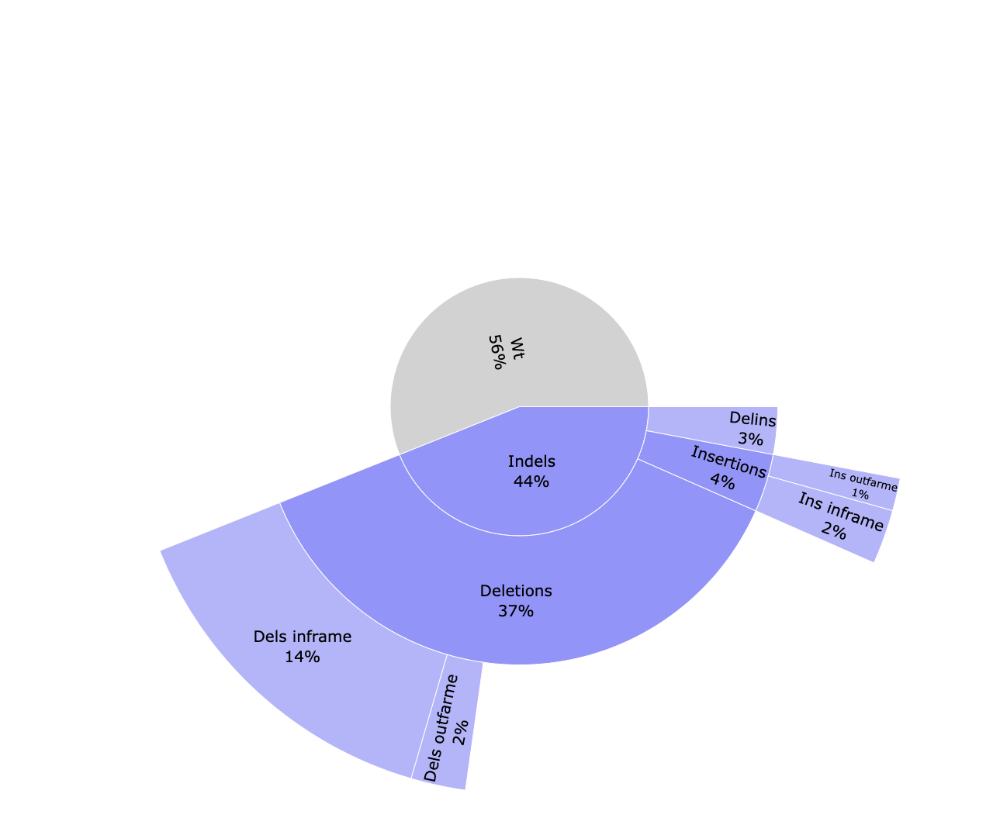
  - `*_edits.csv`: Table containing the number of reads classified to each edition type. Contains the data visualized in the pie chart.
  - `*_indels.csv`: Table containing information of all reads. Edit type, edit start and length, if the edition happens above the error rate, if it's located into the common edit window, the frequency, the percentage, the pattern, surrounding nucleotides in case of insertions, the protospacer cut site, the sample id, number of aligned reads and number of reads with and without a template modification.
  - `*_QC-indels.html`: Interactive pie chart with information about aligned reads. Reads are classified between WT and containing indels. Both types are classified between passing the filtering steps or not. Indel reads passing the filtering steps are divided in reads with a modification above the error rate and located in the common edit window, above the error rate but not in the edit region, vice versa, or any of those conditions. A similar plot can be visualised in the MultiQC report.
    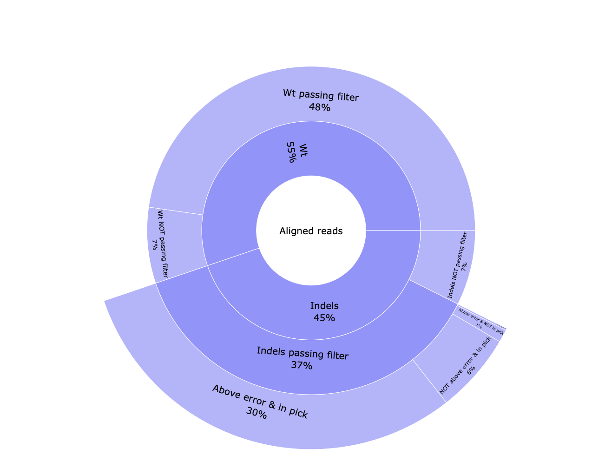
  - `*_reads.html`: Interactive pie chart with percentage of the number of raw reads, reads merged with Pear, reads passing quality filters and UMI clustered reads. A table with this information can be visualised in the MultiQC report.
    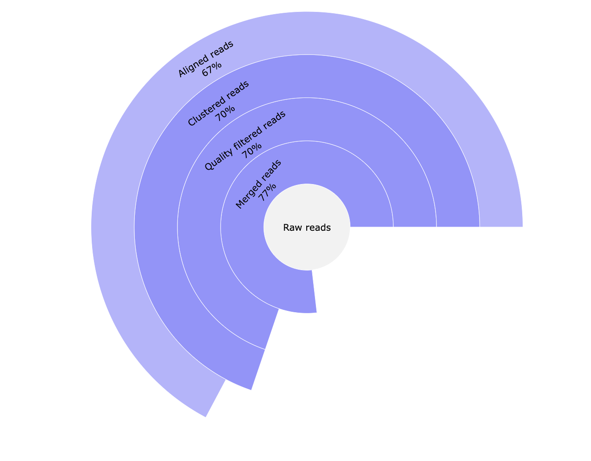
  - `*_subs-perc.csv`: Table containing the percentage of each nucleotide found for each reference position.

### Output plots

Output files

- `plots/`
  - `*_accumulative.html`: Interactive barplot showing the accumulative deletions and insertions. x-axis represents the reference position. y-axis represents the percentage of reads containing a deletion or insertion in that position.
    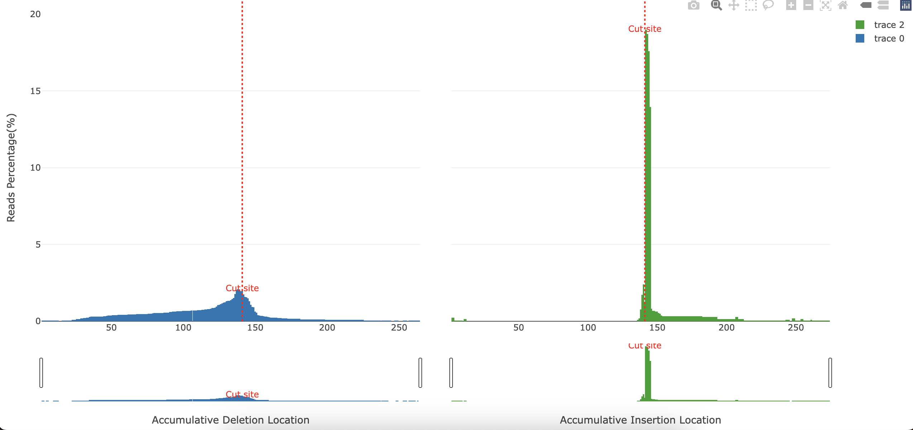
  - `*_delAlleles_plot.png`: Image showing the most common deletions found. x-axis represents the position. y-axis indicates the percentage in which the plotted deletion is observed (in respect of all deletions), followed by the length of the deletion. Dashes `-` indicate a deleted base.
    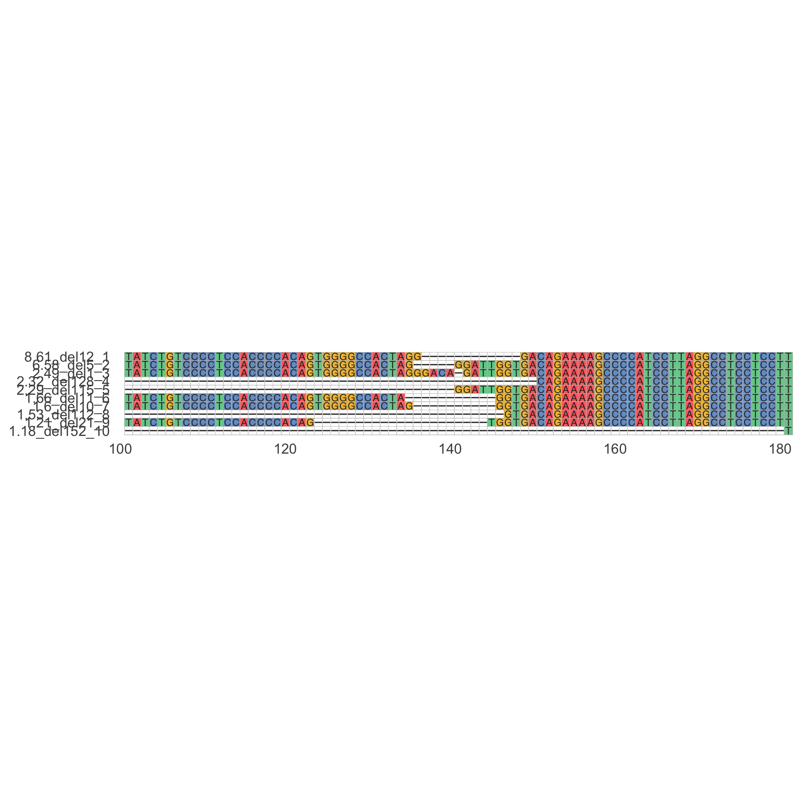
  - `*_Deletions.html`: Interactive barplot showing the percentage of reads showing a deletion for each position and the deletion sizes. The left panel represents the percentage of reads having a deletion for each position (similar to `*_accumulative.html`). The right panel shows the number of deletions found relative to their size. The deleted sequences found are shown coloured in the stacked barplot.
    
  - `*_Insertions.html`: Interactive barplot showing the percentage of reads showing an insertion for each position as well as the insertion sizes. The left panel represents the percentage of reads having an insertion for each position (similar to `*_accumulative.html`). The right panel shows the number of insertions found relative to their size. The inserted sequences found are shown coloured in the stacked barplot.
    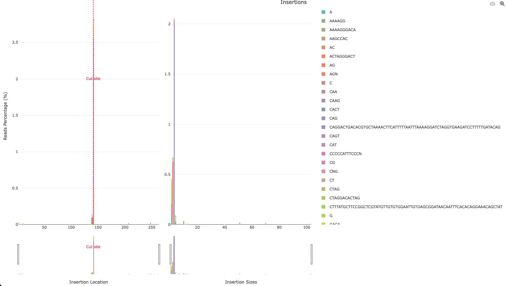
  - `*_subs-perc_plot_LOGO.png`: LOGO showing the most represented nucleotide and its percentage (y-axis) for protospacer positions. PAM sequence is highlighted in yellow.
    
  - `*_subs-perc_plot.png`: Barplot showing the most represented nucleotide and its percentage (y-axis and bar tags) for +/-25 positions surrounding the cut site. The protospacer sequence is highlighted by writing the sequence base in the y axis. Bases whose percentage is higher than 90% are not colored.
    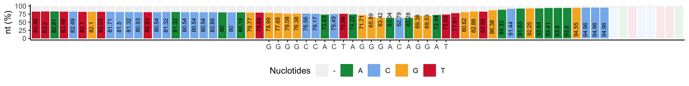
  - `*_top-alleles_LOGO.png`: LOGO showing the 4 most represented editions. Cut site is highlighted with a vertical red line. The type of edition and start position are shown as a title to each LOGO. Deleted bases are not drawn. Inserted bases are highlighted in yellow.
    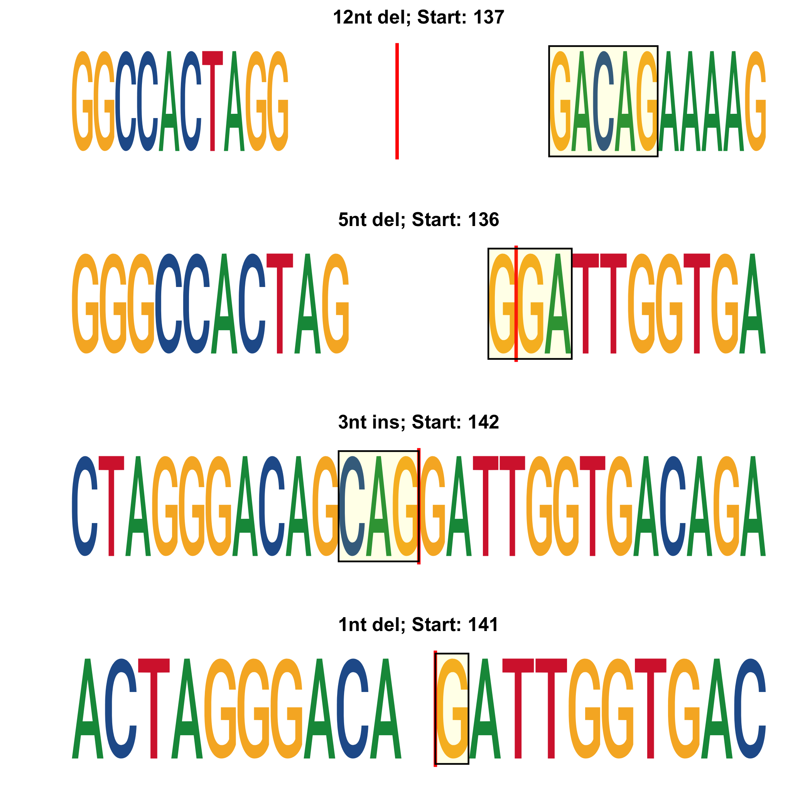
  - `*_top.html`: Interactive pie chart showing the percentage of the top 4 editions found. The percentage of WT is also shown. Editions are named after the position, the type of edition and length and the sequence.
    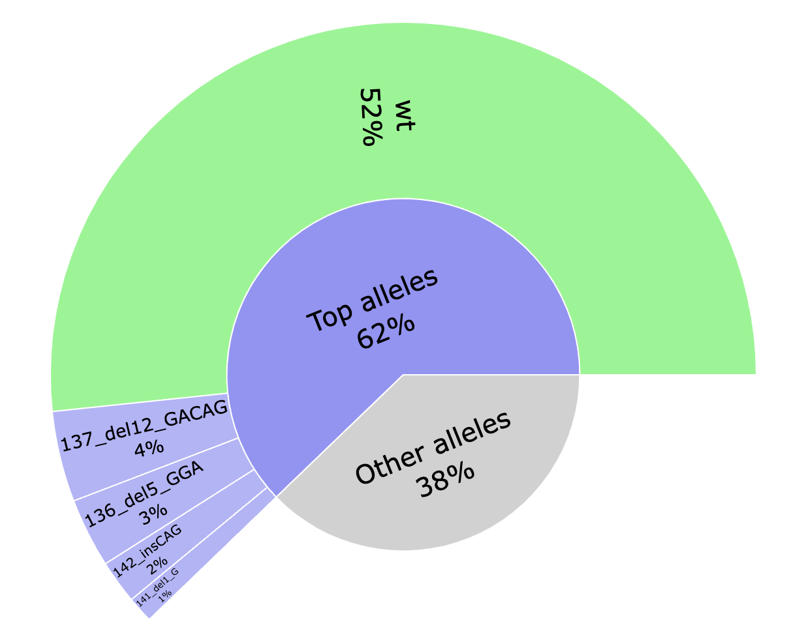

## MultiQC

Output files

- `multiqc/`
  - `multiqc_report.html`: a standalone HTML file that can be viewed in your web browser.
  - `multiqc_data/`: directory containing parsed statistics from the different tools used in the pipeline.
  - `multiqc_plots/`: directory containing static images from the report in various formats.

[MultiQC](http://multiqc.info) is a visualisation tool that generates a single HTML report summarising all samples in your project. Most of the pipeline QC results are visualised in the report and further statistics are available in the report data directory.

Results generated by MultiQC collate pipeline QC from supported tools e.g. FastQC. The pipeline has special steps which also allow the software versions to be reported in the MultiQC output for future traceability. For more information about how to use MultiQC reports, see <http://multiqc.info>.

`multiqc_report.html` contains statistics for FastQC and Cutadapt modules. It also contains a table with statistics about read processing (equivalent to `<outdir>/cigar/*_reads.html` plots), and plots summarising the found editions (equivalent to `<outdir>/cigar/*_edition.html` plots) and indel quality filters (equivalent to `<outdir>/cigar/*_QC-indels.html` plots).

Custom sections example

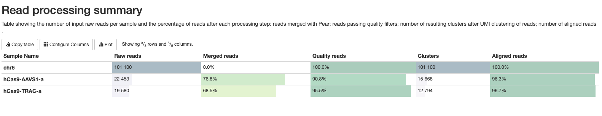
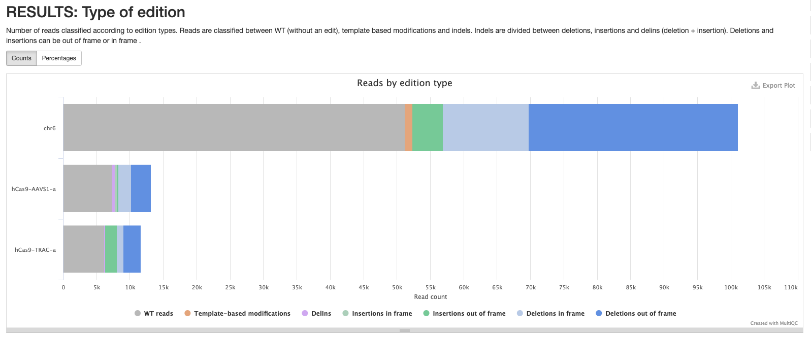
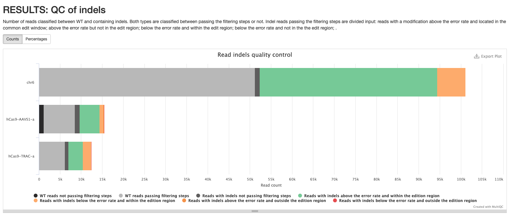

## Pipeline information

Output files

- `pipeline_info/`
  - Reports generated by Nextflow: `execution_report.html`, `execution_timeline.html`, `execution_trace.txt` and `pipeline_dag.dot`/`pipeline_dag.svg`.
  - Reports generated by the pipeline: `pipeline_report.html`, `pipeline_report.txt` and `software_versions.yml`. The `pipeline_report*` files will only be present if the `--email` / `--email_on_fail` parameter's are used when running the pipeline.
  - Reformatted samplesheet files used as input to the pipeline: `samplesheet.valid.csv`.

[Nextflow](https://www.nextflow.io/docs/latest/tracing.html) provides excellent functionality for generating various reports relevant to the running and execution of the pipeline. This will allow you to troubleshoot errors with the running of the pipeline, and also provide you with other information such as launch commands, run times and resource usage.
